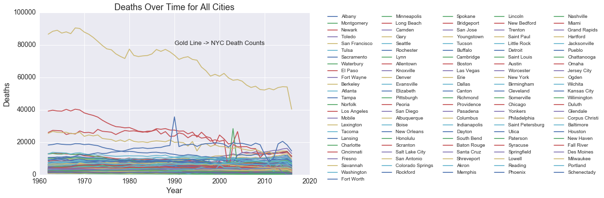

# Portfolio_Projects
Author_: Christian Omar Rosado 

## Mortality Rates Over Time for 122 U.S. Cities

In this personal project, I analyzed mortality rates for 122 U.S. cities and identified signals with significant spikes above a three-sigma threshold. I also applied a clustering algorithm to group cities with similar mortality rates over time into four clusters. These clusters better visualize and summarize trends for mortality rates across the U.S.

## Analysis and Results

Above you'll notice deaths over time for all 122 U.S. cities. The gold line highlights mortality rates for New York City (the most populated city in the U.S.).

.png)

The plot above shows a significant spike in deaths during the 80s and 90s decade for people 25 to 44 years old. After doing some online research, I learned these two decades were plagued with high crime rates, drug use, and the HIV/AIDS epidemic. I also learned President Bill Clinton implemented the 1994 Crime Bill to combat these statistics nationwide.

## Applying Machine/Statistical Learning

Below I applied two clustering algorithms to group U.S. cities into four main clusters. These clusters better visualize and summarize trends for mortality rates across the U.S. I listed the cities for each cluster in the iPython notebook attached to this project.

.png)

.png)

.png)

Enjoy the insights!  
Christian Omar Rosado
